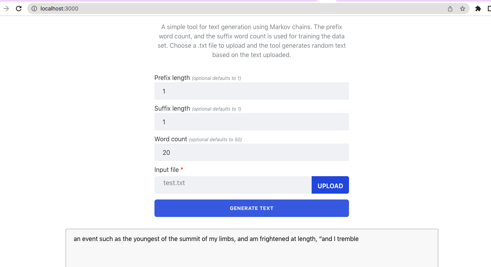

Text Generator Using Markov Chains 
======================================	

This Spring Boot project merged with a React app allows users to generate random text using Markow chains. The Spring Boot application has REST endpoints that generates random text for a given text file.

## Prerequisites
* Java 1.8 or higher
* Node 16.18.0 or higher
* npm 8.19.2 or higher
* Maven 3.8.6 or higher
 
## Running the Full Application
#### Running the backend:

To build the package as a single artifact by running the `./mvnw clean install`. 

To start the Spring Boot application using Maven:
```bash
$ cd stochastic-models
$  ./mvnw spring-boot:run
```

You can access the application at `http://localhost:8080`.
#### Running the frontend:
```
$ cd stochastic-models/ui
$ npm start
```
You can access the frontend React application `http://localhost:3000/`.



## REST APIs
The Spring Boot applications defines following APIs.

* `POST /v1/api/markov/text-generation`

```
curl -X POST -F 'wordCount=50' -F 'prefix=1' -F 'suffix=1' -F 'file=@/path/to/file.txt' http://localhost:8080/v1/api/markov/text-generation
```


